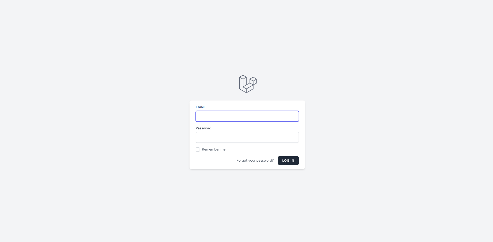
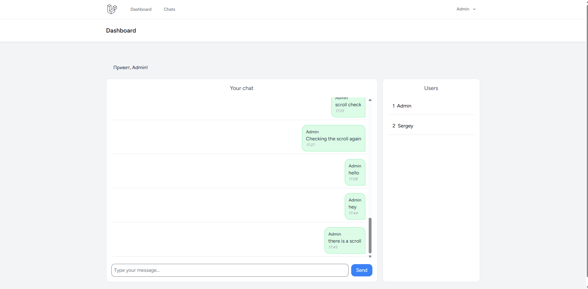
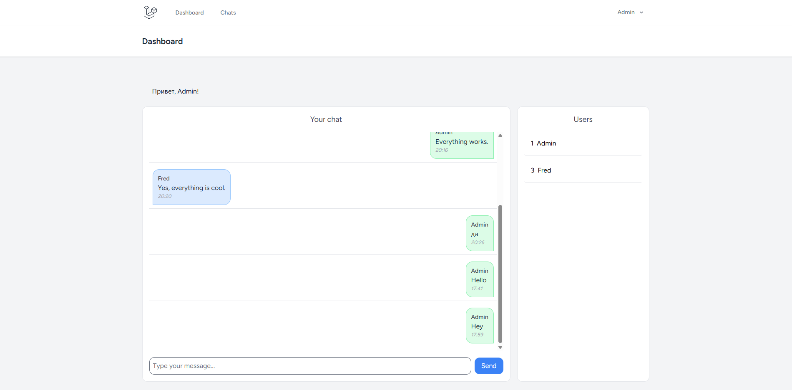
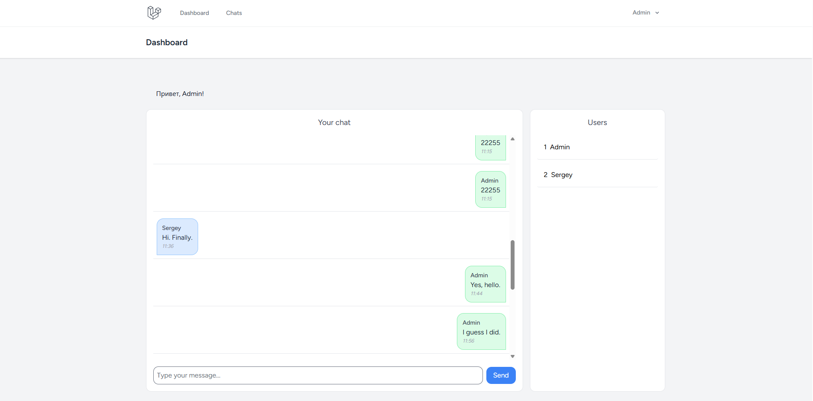
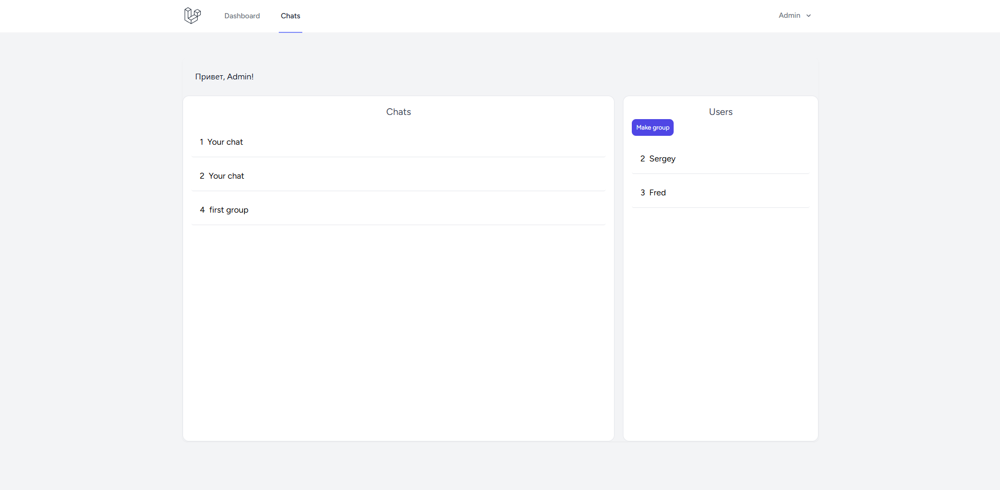

🚀 CommfortChat

## About the Name

The name **CommfortChat** is inspired by the classic desktop messenger **CommFort**.

It combines the words:

- **Communication**
- **Comfort**

CommfortChat is a modern web implementation inspired by the classic LAN messenger CommFort.

The goal of the project is to recreate a simple and comfortable internal chat system using a modern web stack built with Laravel and Vue.js.

CommfortChat is a fullstack web chat application with private and group messaging.
The project simulates a real production workflow and demonstrates practical development, Git collaboration, and deployment skills.

🔗 Live Demo: https://commfortchat.xyz

👤 Demo User: demo@commfortchat.xyz
 / password : 12345678

📸 Preview

<p align="center">
  
</p>
<p align="center">
  
</p>
<p align="center">
  
</p>
<p align="center">
  
</p>
<p align="center">
  
</p>

✨ Core Features

🔐 Authentication (Laravel Breeze)

💬 Private messaging

👥 Group chats

🧵 Message history with auto-scroll

⚡ Dynamic SPA experience with Inertia.js

📱 Responsive layout (Tailwind CSS)

🏗 Architecture Overview

The application follows a monolithic fullstack architecture:

Backend:
Laravel (MVC pattern)

Frontend:
Vue.js + Inertia.js SPA

Communication:
Axios HTTP requests

Database:
MySQL with Eloquent ORM relationships

Authorization:
Role-based access logic

Deployment:
Linux production server (Nginx + PHP-FPM)

The application follows separation of concerns and clean commit history.

🛠 Tech Stack

Backend
- Laravel
- MySQL
- Eloquent ORM
- REST principles

Frontend
- Vue.js
- Inertia.js
- Tailwind CSS
- Axios

DevOps
- Git & GitHub
- Git Flow (main / develop)
- Pull Requests
- Hetzner server
- Nginx + PHP-FPM + SSL

🔁 Development Workflow

The project was developed using a structured Git workflow:

main — stable production-ready branch

develop — active development

Feature-based commits

Regular Pull Requests with descriptions

Merge commits used to preserve development history

Main branch protected from direct pushes

🚀 Deployment

Production environment:

- Ubuntu 22.04
- Nginx
- PHP 8.2 (FPM)
- MySQL
- SSL via Let's Encrypt

The application runs on a production-like environment and is publicly accessible.

⚙️ Local Installation

```bash
git clone https://github.com/Herusweb/CommfortChat.git
cd commfortchat

composer install
npm install

cp .env.example .env
php artisan key:generate

php artisan migrate
npm run build

php artisan serve

📚 What I Learned

Fullstack application development (Laravel + Vue)

SPA architecture using Inertia.js

Client-server communication via Axios

Role-based authorization

Structured Git workflow with PR

Deploying to Linux production server

🎯 Project Purpose

The goal of this project was to demonstrate readiness for a Junior Frontend / Fullstack Developer role by simulating a real development environment and production deployment.

👨‍💻 Author

HerusWeb
Junior Fullstack Developer (Laravel / Vue.js)

GitHub: https://github.com/Herusweb

LinkedIn: [optional]

## License

The Laravel framework is open-sourced software licensed under the [MIT license](https://opensource.org/licenses/MIT).
